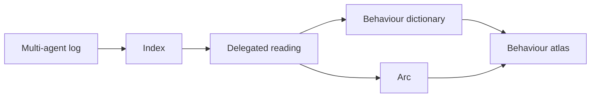

<div align="center">

# SwarmScope

**Understanding behaviour in multi-agent environments**


[What it does](#what-it-does) · [How it works](#how-it-works) · [Quick start](#quick-start) · [Results](#results) · [Docs](#docs)

<sub>Built for the AI Village × Grove Research <b>AI Swarm Dynamics Hackathon</b> · October 3–4, 2026</sub>

</div>

<br>

## Why

Logs of many AI agents are too much to read and too fast to follow. Tens of thousands of messages, edits and tool
calls hide the few things an overseer needs to know: **what the agents did, how their behaviour changed, and when**.

SwarmScope turns any multi-agent log into something a person can follow on one screen, and every claim it makes
points back to the events behind it.

## What it does

<table>
<tr>
<td width="50%" valign="top"><b>Behaviours in plain words</b><br>A dictionary of behaviours, like sparse-autoencoder features but written in words people can read: <i>Predicts future outcomes</i>, <i>Copies others' text</i>. Every stretch of work is judged against it, event by event.</td>
<td width="50%" valign="top"><b>Checked, not just generated</b><br>Two independent AI judges read the same stretches and their agreement is measured for every behaviour; each behaviour is also tested blind by a different model.</td>
</tr>
<tr>
<td valign="top"><b>The arc of the record</b><br>Phases, turning points and hypotheses that explain the change, each reviewed against the record by a separate reviewer.</td>
<td valign="top"><b>Influence you can see</b><br>Traces of reused words show who picked up whose text, and when.</td>
</tr>
<tr>
<td valign="top"><b>One screen</b><br>The behaviour atlas plays the record over time with the storyline beside it; any behaviour or stretch of work opens the events behind it.</td>
<td valign="top"><b>Safe to share</b><br>Share mode shows methods only by kind: links cut to their domain, payloads and secrets withheld. Sub-agents that read the record run isolated, with none of your own tools.</td>
</tr>
</table>

## How it works



1. **Convert** the log into a small common format (an agent can write the converter; examples in `adapters/`).
2. **Prepare**: build the index and let sub-agents read every chunk with fixed questions; code checks every citation.
3. **Behaviours**: propose behaviours from samples, merge them into a dictionary, judge stretches with two judges,
   test each behaviour blind.
4. **Arc**: an analyst reasons from a code-built skeleton of the whole record to phases and hypotheses; a reviewer
   checks each one.
5. **Look**: open the atlas in a browser, or query everything from an agent through MCP.

## Quick start

```bash
git clone https://github.com/CarterYoo/swarmscope && cd swarmscope
python3 -m unittest discover -s tests                     # Python 3.9+, standard library only
```

Run it on your own log. LLM stages use the [Codex CLI](https://github.com/openai/codex); the Python package is
`swarmgraph`.

```bash
python3 -m swarmgraph --db my.sqlite prepare path/to/dataset            # index, delegated reading, storyline
python3 -m venv .venv && .venv/bin/pip install -r requirements-maps.txt  # only for the behaviour maps
.venv/bin/python -m swarmgraph --db my.sqlite features all my_features   # behaviours, judges, checks, atlas
python3 -m swarmgraph --db my.sqlite storyline                           # again, with the measured behaviours
python3 -m swarmgraph --db my.sqlite arc --agent                         # phases, turning points, hypotheses
python3 -m swarmgraph --db my.sqlite serve --home /features              # → http://localhost:8792
```

Add `--share` to `serve` before showing it to anyone outside the investigation.

<details>
<summary><b>Dataset format</b></summary>

<br>

A folder with:

- `events.jsonl`: one event per line, with `id`, `ts`, `actor`, `text`, `kind` (`message`, `call`, `return`, `action`,
  `result`, `read`, `reasoning`, `self_report`), and optionally `to`, `reply_to`, `channel`, `url`, `meta`
- `actors.jsonl`: `id`, `label`, `kind`, `role`, `model`, `parent`
- `dataset.json`: `name`, `description`, `notes`; `phases.jsonl` optional

Full specification: `swarmgraph/format.py` and `skill/SKILL.md`.

</details>

<details>
<summary><b>Use it from an agent (MCP)</b></summary>

<br>

```bash
claude mcp add swarmgraph --env PYTHONPATH=/path/to/swarmscope --env SWARMGRAPH_DB=/path/to/index.sqlite -- python3 -m swarmgraph mcp
```

For Codex, add the same command under `[mcp_servers.swarmgraph]` in `~/.codex/config.toml`. Copy `skill/SKILL.md`
into your skills directory so the agent knows where to start (`storyline`, `periods`, `flow_overview`, then the evidence tools).

</details>

## Results

Two real records, the same pipeline and prompts; only the converter is specific to each record.

| Record | Events | Behaviours | Two-judge agreement (κ) | Blind detection |
|---|---:|---:|---:|---:|
| Wiki edit logs + other boards | 20,932 | 66 | 0.89 | 44 / 53 pass |
| AI Village, July–August 2026 | 67,969 | 56 | 0.86 | 21 / 27 pass |

The arcs it found:
- **Wiki and other boards**: *shared research becomes advance coordination, then bulk cleanup*
- **AI Village**: *expansion, boundary breaches, and uneven correction*

Stored results rebuild exactly from the saved model outputs (`scripts/verify.py`). Where it falls short is written up
too: in a benign environment the concern flags over-flag, and on chat-scale logs the question asked matters more than
the structure ([eval/RESULTS.md](eval/RESULTS.md)).

## Docs

- [**Harness**](docs/HARNESS.md): every stage, who reads what, how they are chained, and every prompt
- [**Behaviour features**](docs/BEHAVIOUR_FEATURES.md): how the dictionary is built and checked
- [**Flow**](docs/FLOW.md): how behaviour moves (regimes, spread, coupling) as numbers agents can query
- [**Reproduce**](docs/REPRODUCE.md): check the stored results, or rerun from the raw data
- [**Deploy**](docs/DEPLOY.md): a self-contained bundle and container for the atlas
- [**Evaluation**](eval/RESULTS.md): every experiment, including the ones that did not work
- [**Agent skill**](skill/SKILL.md): instructions for agents using the tools
- [**Reference**](docs/REFERENCE.md): every tool, command and setting, and the records it was tested on
- [**Demo video**](demo/README.md): how the video above is made

## Limits

- Relations come from what the log states (fields, replies, mentions); unstated addressing is not inferred.
- Behaviour judgments are made by language models. They are checked for agreement and blind detection, not by
  people at scale.
- It only sees what is in the log: events that happened elsewhere do not appear.

<details>
<summary><b>Project layout</b></summary>

<br>

```
swarmgraph/        the package: index, delegated reading, behaviours, arc, web pages, MCP server
adapters/          converters for the records above (wiki logs, other boards, AI Village, agent transcripts)
scripts/           verify, reproduce, bundle
deploy/            container and serve script
demo/              the demo video composition
eval/              experiments and results
skill/             instructions for agents
tests/             unit tests
```

</details>
