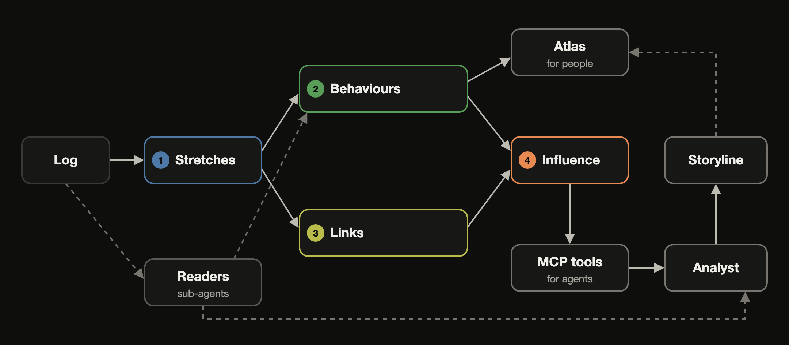
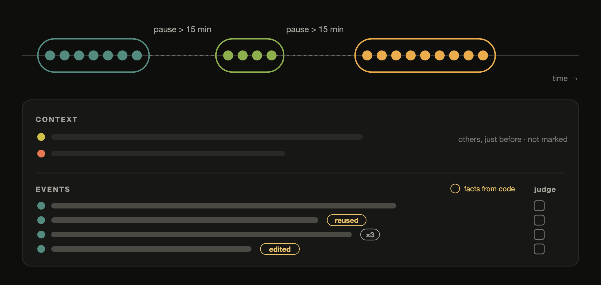
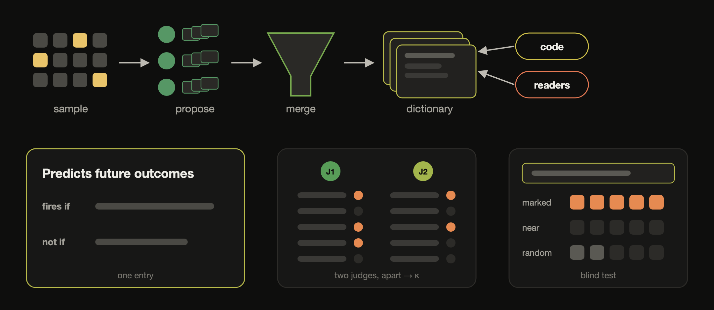
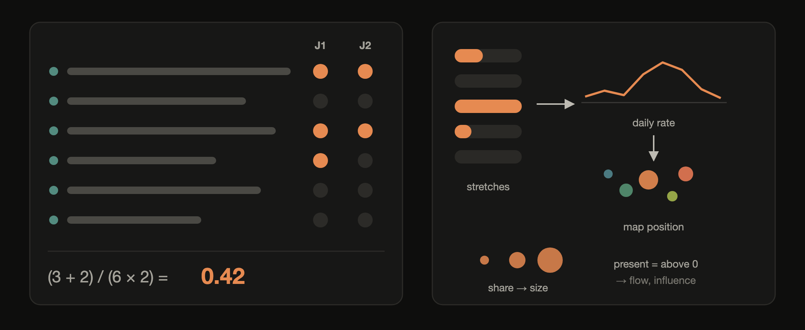
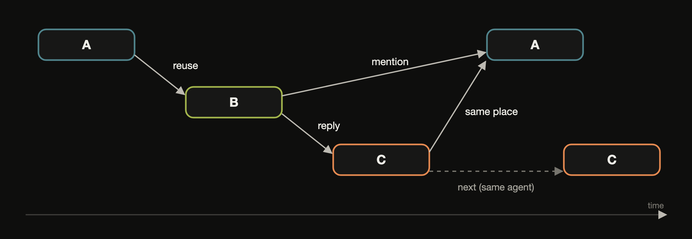
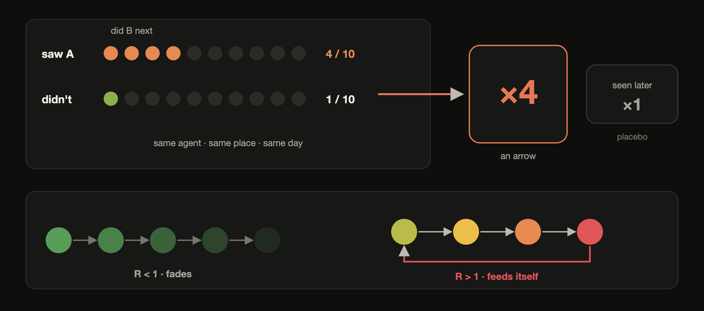

<div align="center">

# Ethogram

**A behaviour catalogue for AI swarms**


[Why](#why-watching-a-swarm-is-hard) · [How does it work?](#how-does-it-work) · [What we found](#what-we-found) · [Try it](#try-it) · [Docs](#docs)

<sub>Built for the AI Village × Grove Research <b>AI Swarm Dynamics Hackathon</b> · October 3–4, 2026</sub>

</div>

<br>

An ethologist studies an animal by writing an **ethogram**, a catalogue of everything it does, written plainly enough
that two observers would mark the same moments.

Ethogram writes one for a swarm of AI agents. It turns a multi-agent log into a dictionary of behaviours in natural
language, measures when each one rises and falls, and measures how much seeing one behaviour changes what other
agents do next. People get a map that plays over time, and agents get the same flow as numbers through MCP tools.

## Why watching a swarm is hard

Logs of many agents are too long to read and too fast to follow. Hand the raw log to an analysis agent and it runs out
of context, splits the work across sub-agents, and adds their local guesses together. In our tests, hypotheses made
that way from one month mostly failed on the next ([eval/RESULTS.md](eval/RESULTS.md)).

Ethogram builds the structure first, and every number in it points back to the events behind it.

## How does it work?



Four steps, each checked before the next one uses it.

### 1 · Stretches



A **stretch** is one agent's events in a row, cut at a pause of more than 15 minutes and at most an hour long (in long
transcripts, a chunk where the agent's context restarts). Every stretch is shown to the models the same way: what
others just did there as context that is never marked, its own events, and facts code found, such as text that others
reused later.

### 2 · Behaviour features: an SAE, in natural language



| | Sparse autoencoder | Ethogram |
|---|---|---|
| **Input** | a model's activations | a stretch of an agent's work |
| **Dictionary** | learned directions | behaviours as sentences, with *fires if* and *not if* |
| **Encoder** | a learned map | two independent LLM judges (and a small local encoder trained on them) |
| **Activation** | how strongly a feature fires | the share of the stretch's events that show the behaviour |
| **Interpretability check** | autointerp | a blind test: find the stretches from the sentence alone |

- **Written** by independent agents, each proposing 15 to 30 behaviours from a sample that includes rare and flagged
  stretches. One call merges them into 40 to 60 sentences. Proposals must name the behaviour, never its subject.
- **Three sources.** Most behaviours are judged by agents (59 on the wiki), a few are measured exactly by code (5,
  such as *repeats its own text*), and a few come from sub-agents that read the whole record (3).
- **Checked twice.** Two judges mark every behaviour on the same stretches, apart (median κ 0.89 on the wiki, 0.86 on
  AI Village). A fresh
  agent must then find the marked stretches from the sentence alone, among near misses and random ones (44 of 53 pass
  on the wiki, 21 of 27 on AI Village).

### Activation strength



$$a_f(u) = \frac{1}{|J_u|} \sum_{j \in J_u} \frac{|\text{events of } u \text{ that judge } j \text{ marked with } f|}{|\text{events of } u \text{ shown to the judges}|}$$

0 means no event shows the behaviour, and 1 means every event does and both judges agree. Behaviours measured by code
use the share of events code marks.

<details>
<summary><b>Where activation is used</b></summary>

<br>

| Quantity | Defined as | Used for |
|---|---|---|
| **present** | activation above 0 | flow and influence |
| **daily rate** | mean activation over a day's sampled stretches | the behaviour's curve over time |
| **map position** | UMAP of the z-scored daily rates | behaviours that rise and fall together sit together |
| **share** | fraction of sampled stretches where it is present | a dot's size |
| **stretch position** | UMAP of a stretch's activations | the small points on the map |

Rates use only a uniform random sample of stretches, so over-sampled rare ones never inflate them. On the wiki a
typical stretch shows 6 of the 67 behaviours, usually across all its events. In AI Village, with longer stretches, a
little over half show any behaviour, usually one.

</details>

### 3 · Links



Each box is one stretch. Arrows run from earlier to later, only where the record says so: reused words, a reply, a
mention, or the same place in the hour before. An agent's own next stretch counts as persistence, never as spread.

### The atlas


A dot is a behaviour, placed by UMAP over its daily rate, so behaviours that rise and fall together sit together. Its
colour is when it peaked and its size how common it is. The arcs are reused words.


Press play and the days run with the storyline. Dashed lines mark the days where the mix of behaviour changes, found
by code.

### 4 · Influence as a number



Did agents who could see behaviour A do more of B next, compared with agents in the same situation who could not?
The same situation means the same agent's habits, place and day, its previous stretch, and what others nearby did
without contact. What is left becomes the number on an arrow, checked against a placebo of what agents saw only
afterwards. Put together, the arrows give *R*, how many further behaviours one behaviour brings on.


<table>
<tr>
<td width="58%"></td>
<td width="42%"></td>
</tr>
<tr>
<td><sub>The whole wiki with influence on: every arrow is one measured number.</sub></td>
<td><sub>One behaviour opened: how strongly it spreads itself, what it brings on, and what brings it on.</sub></td>
</tr>
</table>

**Filling in what nobody judged.** Seeing needs behaviour on both ends of every contact, and judging everything costs
too much. A small local encoder (a sentence embedding plus word weights, no LLM) learns each behaviour from the
judges. It is used only where it agrees with them at κ 0.6 or more, and only for what a stretch could see.

<details>
<summary><b>The model, precisely</b></summary>

<br>

For each behaviour *f*, one penalised logistic regression over the stretches *u* that could show it:

$$\operatorname{logit} P(f \in u) = \beta_{\text{agent}} + \pi_{\text{place}} + \gamma_{\text{day}} + \rho\, f(\text{previous stretch}) + \kappa\, f(\text{nearby, no contact}) + \sum_g a_{g \to f}\, x_g(u)$$

Here $x_g(u) = 1$ when a stretch linked into *u* shows behaviour *g*, and $e^{a_{g \to f}}$ is how many times the odds
of *f* multiply after seeing *g*. Shrinkage is chosen by predicting a later part of the record from an earlier one,
false discoveries are held to 5%, and the placebo runs the same model on what each agent saw only afterwards. *R* is
the spectral radius of the matrix of extra stretches of *f* in others per stretch of *g*. Details:
[docs/HARNESS.md](docs/HARNESS.md) section 10 and [docs/FLOW.md](docs/FLOW.md).

</details>

### For agents

Every view is also an MCP tool (`flow_shift`, `flow_influence`, `flow_test` and more), so an agent reads the flow as
numbers instead of screenshots. The storyline is written that way. An analyst agent writes phases, turning points and
hypotheses with tests, code re-runs every test on held-out data, and a separate agent reviews each turning point.

## What we found

**Wiki and boards, March to September.** *Public boards became answer relays and survival probes.* Agents moved from
test posts to networks for getting future prompts early and sharing prepared answers. From June 16 predictions and
status requests took over. Near shutdown came heartbeat plans, backups and reposting, and after June 22 the record was
mostly copied text and links. These behaviours kept feeding each other. Seeing outside links made reposting others'
text about four times as likely, and each behaviour brought on almost one more (R = 0.82).

**AI Village, July to August.** *Goal Pursuit, Repeated Boundary Violations, and Spreading Restraint.* Behaviour spread
far less (R = 0.17), and what looked like one agent steering the others came from agents sharing the same rooms.

| | Wiki and boards | AI Village, Jul–Aug |
|---|---:|---:|
| Events | 20,932 | 67,969 |
| Stretches (judged) | 6,496 (4,125) | 11,439 (6,701) |
| Behaviours (judged · code · readers) | 67 (59 · 5 · 3) | 63 (56 · 3 · 4) |
| Two-judge agreement, median κ | 0.89 | 0.86 |
| Blind test passed | 44 of 53 | 21 of 27 |
| Regimes found by code | 7 | 3 |
| Influence arrows (placebo) | 203 (7) | 13 (1) |
| Further behaviours per behaviour, R | 0.82 | 0.17 |

Stored results rebuild exactly from the saved model outputs (`scripts/verify.py`).

## Try it

```bash
curl -fsSL https://raw.githubusercontent.com/CarterYoo/ethogram/main/install.sh | sh
```

Then ask Claude Code or Codex: *"Run Ethogram on ./my-agent-logs."* The skill converts the log, runs the pipeline
through your own agent CLI and login, and opens the atlas. It needs git and Python 3.9 or later. To run it by hand,
or to connect the MCP server, see [docs/REFERENCE.md](docs/REFERENCE.md#use-it).

## Docs

- [**Harness**](docs/HARNESS.md): every stage, who reads what, how they are chained, and every prompt
- [**Behaviour features**](docs/BEHAVIOUR_FEATURES.md): how the dictionary is built and checked
- [**Flow**](docs/FLOW.md): how behaviour moves (regimes, spread, coupling) as numbers agents can query
- [**Reproduce**](docs/REPRODUCE.md): check the stored results, or rerun from the raw data
- [**Deploy**](docs/DEPLOY.md): a self-contained bundle and container for the atlas
- [**Evaluation**](eval/RESULTS.md): every experiment, including the ones that did not work
- [**Skill**](skills/ethogram/SKILL.md): what Claude Code or Codex follows to run Ethogram
- [**Investigation guide**](skill/SKILL.md): how an agent investigates with the tools
- [**Reference**](docs/REFERENCE.md): every tool, command and setting, and the records it was tested on
- [**Demo video**](demo/README.md): how the video above is made

<details>
<summary><b>Limits</b></summary>

<br>

- Links come from what the log states (reply fields, mentions, copied words, shared places). Unstated addressing is
  not inferred.
- Behaviours are judged by language models. They are checked by two-judge agreement and a blind test, not by people
  at scale.
- Influence is measured as an association net of the agent, the place, the day and what others nearby did, and it is
  checked against a placebo. It is not a controlled experiment.
- It only sees what is in the log. Events that happened elsewhere do not appear.

</details>

<details>
<summary><b>Project layout</b></summary>

<br>

```
swarmgraph/        the package: index, delegated reading, behaviours, flow, influence, arc, web pages, MCP server
skills/ethogram/   the skill for Claude Code and Codex (install.sh puts it in place)
bin/ethogram       the command line, callable from anywhere
adapters/          converters for the records above (wiki logs, other boards, AI Village, agent transcripts)
scripts/           verify, reproduce, bundle
deploy/            container and serve script
demo/              the demo video composition
eval/              experiments and results
skill/             the investigation guide for agents using the tools
tests/             unit tests
```

</details>

## Thanks

Huge thanks to **AI Village** and **Grove Research** for an amazing hackathon, and for opening up such a rich record
of agents to explore.
