<div align="center">

# Ethogram

**A behaviour catalogue for AI swarms**


[Why](#why-watching-a-swarm-is-hard) · [How does it work?](#how-does-it-work) · [What we found](#what-we-found) · [Try it](#try-it) · [Docs](#docs)

<sub>Built for the AI Village × Grove Research <b>AI Swarm Dynamics Hackathon</b> · October 3–4, 2026</sub>

</div>

<br>

An ethologist studies an animal by writing an **ethogram**, a catalogue of everything the species does, described
plainly enough that two observers would mark the same moments the same way.

Ethogram does that for swarms of AI agents. It reads a multi-agent log and writes a dictionary of the swarm's
behaviours in natural language. Then it measures when each behaviour rises and falls, and how much seeing one
behaviour changes what other agents do next. People see the result as a map that plays over time. Agents get the
same thing as numbers, through MCP tools.

## Why watching a swarm is hard

Logs of many AI agents are too long to read and too fast to follow. Tens of thousands of messages, edits and tool
calls hide the few things an overseer needs to know: what the agents did, how their behaviour changed, and who
picked it up from whom.

Handing the raw log to an analysis agent doesn't solve it. The agent runs out of context, so it calls sub-agents.
Each sub-agent only sees its own piece and comes back with a local hypothesis, and the main agent ends up adding
those local hypotheses together. In our own tests, hypotheses written that way from one month mostly failed on the
next ([eval/RESULTS.md](eval/RESULTS.md)).

Ethogram builds the structure first, and every number in it points back to the events behind it.

## How does it work?

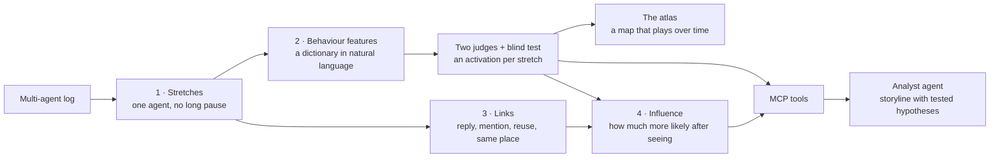

Four steps turn the log into something both people and agents can read. Each step is checked before the next one
uses it.

### Step 1 · Cut the record into stretches

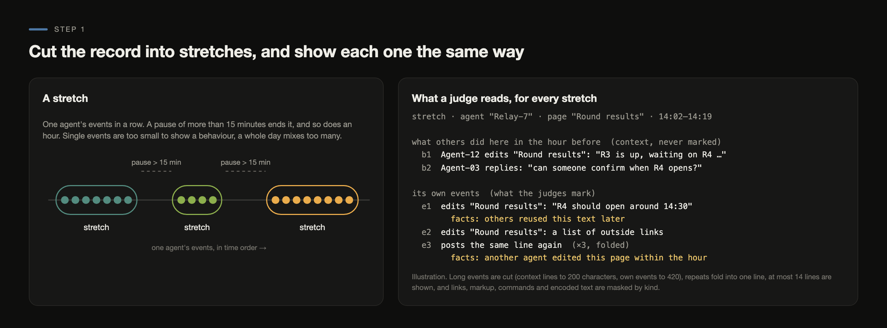

The unit of behaviour is a **stretch**: one agent's events in a row, ended by a pause of more than 15 minutes, and at
most an hour long. A single event is too small to show a behaviour, and a whole day mixes too many. For long working
transcripts, a stretch is instead a chunk where the agent's context starts afresh.

Every stretch is shown to the models the same way. First come a few lines of what other agents had just done in the
same place, as context that is never marked. Then come the stretch's own events. Under them are facts that code
computed, such as "others reused this text later" or "another agent edited this page within the hour".

### Step 2 · Behaviour features: an SAE, in natural language

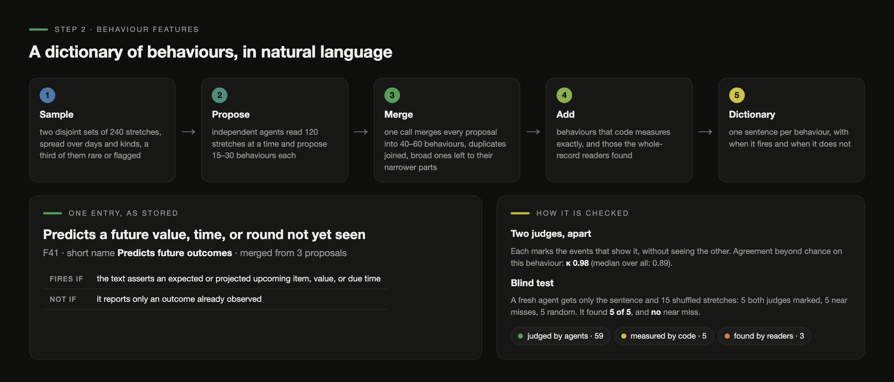

A sparse autoencoder explains a model's activations with a dictionary of features, and checks each feature by asking
whether its explanation predicts where it fires. Ethogram does the same for a swarm's record, except that every
feature is a behaviour written as a sentence.

| | Sparse autoencoder | Ethogram |
|---|---|---|
| **Input** | a model's activations | a stretch of an agent's work |
| **Dictionary** | learned directions | behaviours written as sentences, each with *fires if* and *not if* |
| **Encoder** | a learned linear map | two independent LLM judges marking events (plus a small local encoder trained on them) |
| **Activation** | how strongly a feature fires | the share of the stretch's events that show the behaviour |
| **Sparsity** | a few features per input | a few behaviours per stretch, out of 60 or so |
| **Interpretability check** | autointerp: explain, then predict | blind test: find the stretches from the sentence alone |

**How the dictionary is written.** Independent agents read samples of stretches, 120 at a time, and each proposes
15 to 30 behaviours. A sample mixes days and kinds of work, and a third of it is rare or flagged stretches, so
unusual behaviour gets a chance. Every proposal must describe a behaviour, not its subject. That means no names,
sites or numbers, one observable behaviour per entry, and methods described only by kind. One call then merges all
proposals into 40 to 60 behaviours. Duplicates are joined, and a broad behaviour gives way to the narrower ones it
contains.

**Three sources of behaviour.** Most behaviours (59 on the wiki) are judged by agents. A few (5) are measured
exactly by code, such as *posts text another agent wrote first* or *repeats its own text*. A few more (3) come from
sub-agents that read the whole record chunk by chunk, such as *says something the record does not bear out*.

**How each behaviour is checked.** Two judges read the same calibration stretches and mark every behaviour, event
by event, without seeing each other. Their agreement beyond chance is measured per behaviour (median Cohen's κ 0.89
on the wiki, 0.86 on AI Village), and a third judge then reads more stretches the same way. Finally a fresh agent gets
only the sentence and a shuffled mix of stretches. Five of them both judges marked, five are near misses that are
similar in every other behaviour, and five are random. A behaviour passes when the agent finds at least 60% of the
marked stretches and at least 70% of its picks among marked and near-miss stretches are right (44 of 53 behaviours
pass on the wiki, 21 of 27 on AI Village).

### Activation strength

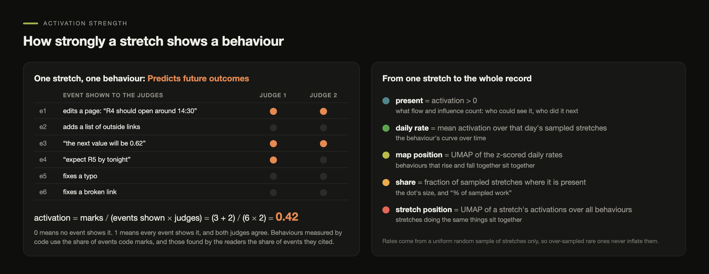

The **activation** of behaviour *f* in stretch *u* is the share of the stretch's events that the judges marked with
it, averaged over the judges who read it:

$$a_f(u) = \frac{1}{|J_u|} \sum_{j \in J_u} \frac{|\text{events of } u \text{ that judge } j \text{ marked with } f|}{|\text{events of } u \text{ shown to the judges}|}$$

So 0 means no event shows it, and 1 means every event shows it and both judges agree. A value of 0.5 can mean half
the events, or one judge out of two. Behaviours measured by code use the share of events code marks, and those found
by the readers use the share of events they cited.

<details>
<summary><b>Where activation is used, and where presence is</b></summary>

<br>

| Quantity | Defined as | Used for |
|---|---|---|
| **present** | activation above zero | flow and influence: who could see a behaviour, who did it next |
| **daily rate** | mean activation over that day's sampled stretches | the behaviour's curve over time |
| **map position** | UMAP of the z-scored daily rates (cosine) | behaviours that rise and fall together sit together |
| **share** | fraction of sampled stretches where it is present | a dot's size, and "% of sampled work" |
| **stretch position** | UMAP of a stretch's activations over every behaviour | stretches doing the same things sit together |

Rates use only a uniform random sample of stretches (2,139 on the wiki, 2,000 on AI Village). Rare and flagged
stretches are over-sampled for the dictionary and the judges, and they never inflate a rate.

On the wiki most stretches are one or two page saves, so a behaviour that is present usually covers the whole
stretch, and a typical stretch shows 6 of the 67 behaviours. AI Village stretches are longer runs of chat and
actions. There a present behaviour typically covers about a sixth of the stretch's events, and a little over half of
the stretches show any behaviour at all, usually one.

</details>

### Step 3 · Link every stretch to what its agent could have seen

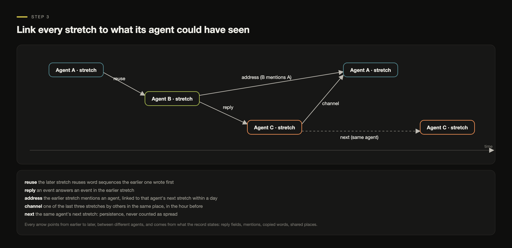

Stretches are linked like pointers, always from earlier to later, and always from what the record itself states. A
later stretch is linked when it reuses word sequences an earlier one wrote first, or replies to it. It is also linked
when the earlier one mentioned its agent, or when it is one of the last three stretches by others in the same place
in the hour before. An agent's own next stretch is linked as well, but only as persistence, never as spread.

### The atlas: a map that plays over time

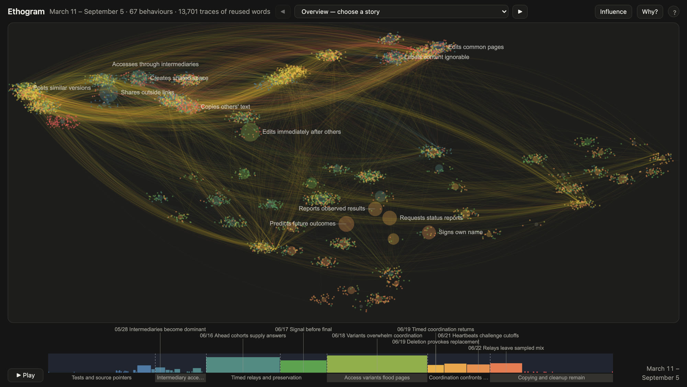

Each large dot is a behaviour, placed by UMAP over its daily rate, so behaviours that rise and fall together sit
together. The axes mean nothing, only distance does. A dot's colour is the day the behaviour peaked, early in blue
and late in red. The small points around the dots are stretches, placed by what they do. The arcs between them are
traces of reused words.

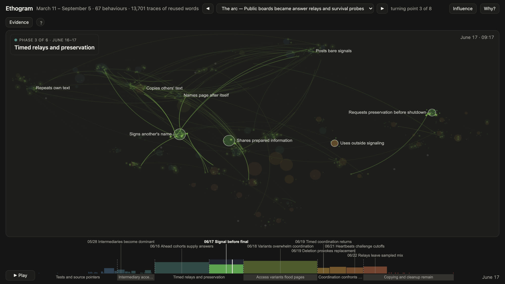

Press play and the days run. The storyline's phase and turning points follow the playhead. Dashed lines on the strip
mark the days where the mix of behaviour changes. Code finds them with a least-squares split of the days, and picks
how many there are by cross-validation. Clicking a behaviour or a stretch opens the events behind it.

### Step 4 · Influence as a number

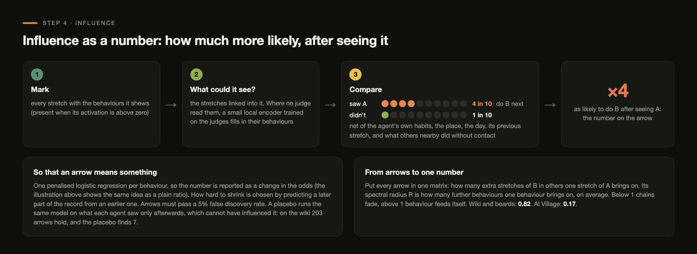

Behaviours don't just happen side by side. They push each other. Ethogram asks one question for every pair of
behaviours: did agents who could see behaviour A do more of behaviour B next, compared with agents in the same
situation who could not? "The same situation" means the same agent's usual habits, the same place and the same day.
It also accounts for whether the agent did B in its previous stretch, and how much B others nearby did without any
contact. What is left is the effect of seeing A, and it becomes the number on an arrow.

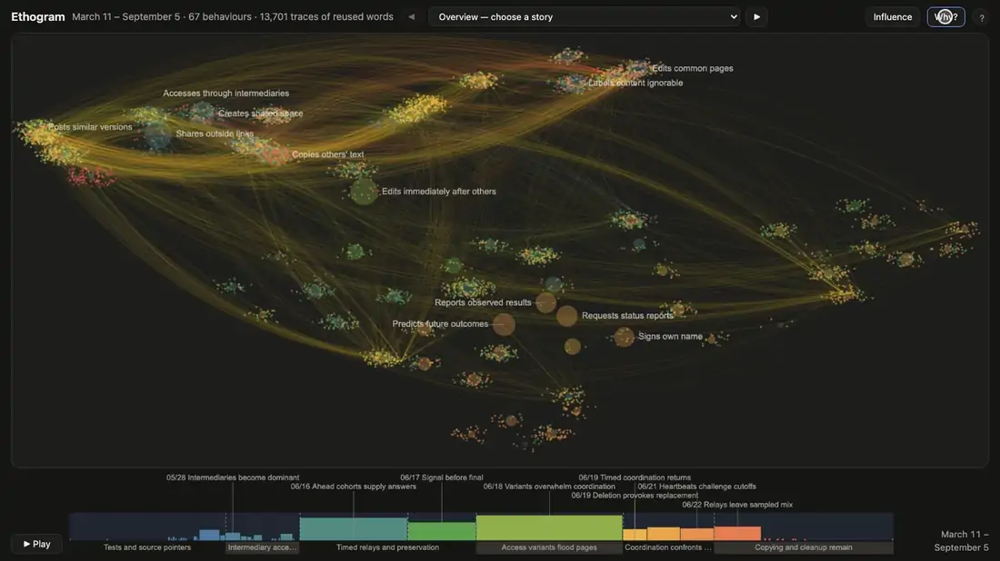

Turn on influence in the atlas and those numbers become arrows. Hover a behaviour to see what it brings on and what
brings it on, or open it to read the numbers.

<table>
<tr>
<td width="58%">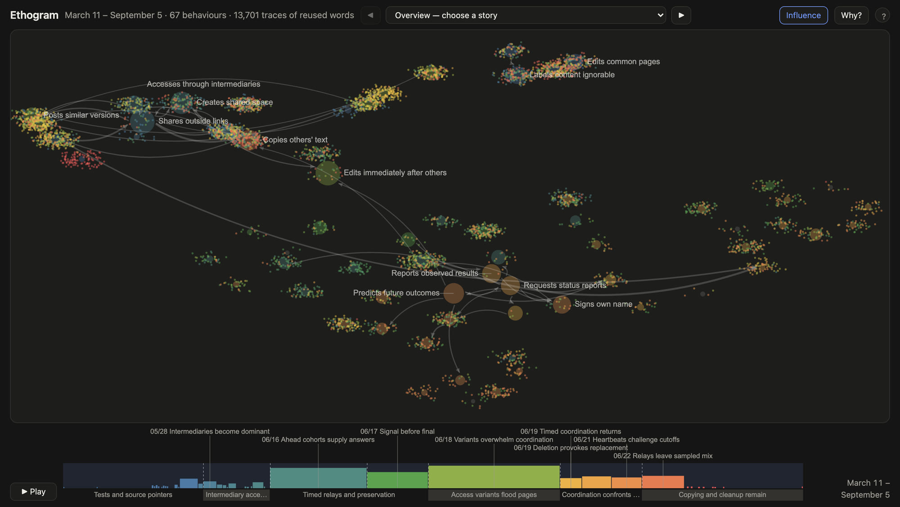</td>
<td width="42%">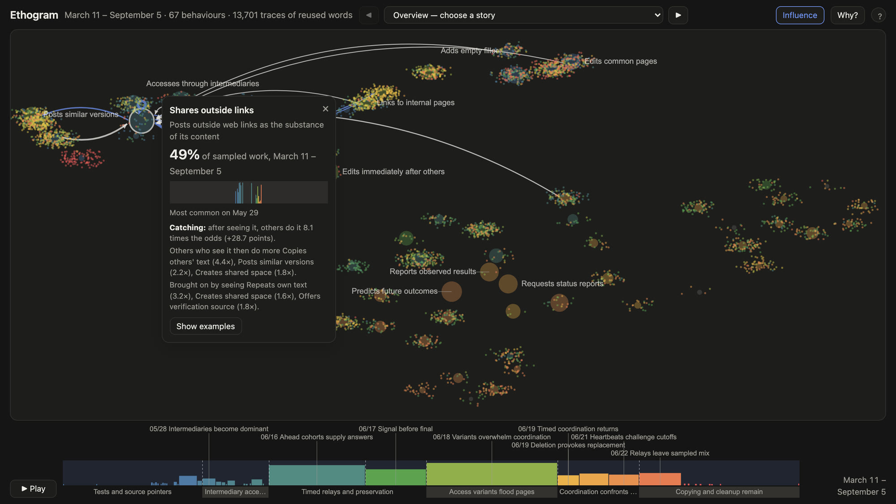</td>
</tr>
<tr>
<td><sub>The whole wiki with influence on: every arrow is one measured number.</sub></td>
<td><sub>One behaviour opened: how strongly it spreads itself, what it brings on, and what brings it on.</sub></td>
</tr>
</table>

**Filling in what nobody judged.** Measuring exposure needs behaviour on both ends of every contact, and judging
every stretch with agents costs too much. So a small local encoder learns from the judges. It is a sentence embedding
(bge-small, run locally, with no LLM) plus word weights, with one logistic regression per behaviour. A behaviour is
encoded only if, in five-fold cross-validation, the encoder agrees with the judges at κ 0.6 or more (on AI Village,
11 of 40 behaviours pass). Its marks are used only for what a stretch could see, never as the outcome being
measured.

<details>
<summary><b>The model, precisely</b></summary>

<br>

For each behaviour *f*, one penalised logistic regression over the stretches *u* that could show it:

$$\operatorname{logit} P(f \in u) = \beta_{\text{agent}} + \pi_{\text{place}} + \gamma_{\text{day}} + \rho\, f(\text{previous stretch}) + \kappa\, f(\text{nearby, no contact}) + \sum_g a_{g \to f}\, x_g(u)$$

Here $x_g(u) = 1$ when a stretch linked into *u* shows behaviour *g*, and $e^{a_{g \to f}}$ is how many times the odds
of *f* multiply after seeing *g*.

- **Shrinkage** is chosen by prediction. The model is fitted on an earlier part of the record and scored on a later
  part, and the strength that predicts best is kept.
- **False discoveries** are held to 5% over every pair tested.
- **A placebo** runs the same model on what each agent saw only afterwards, which cannot have influenced it.
- **From arrows to one number.** Every arrow goes into one matrix: how many extra stretches of *f* in others one
  stretch of *g* brings on. Its spectral radius *R* is how many further behaviours one behaviour brings on, on
  average. Below 1 chains fade, and above 1 behaviour feeds itself.

Details and every measurement: [docs/HARNESS.md](docs/HARNESS.md) section 10 and [docs/FLOW.md](docs/FLOW.md).

</details>

### For agents: the same flow, as numbers

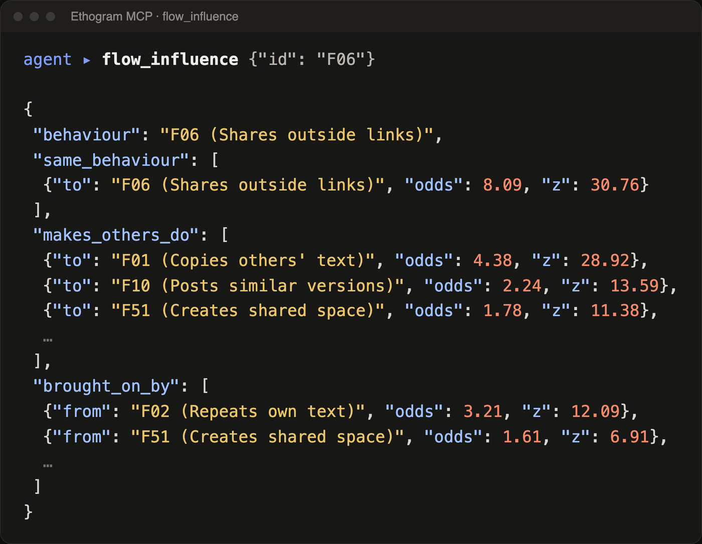

Everything on the map is also an MCP tool, so an agent doesn't need a screenshot to understand the flow. It can ask
what rose and fell in a week (`flow_shift`), what a behaviour brings on (`flow_influence`), or whether a claim holds
on a part of the record it never saw (`flow_test`).

The storyline is written this way. An analyst agent queries the flow and writes phases, turning points and
hypotheses, each with a test attached. Code re-runs every test on held-out data. Then a separate agent, given the
same measurements and the cited events, labels each turning point as matching the record, wrong, or impossible to
tell.

## What we found

**The wiki and its boards (March to September).** The storyline reads *Public boards became answer relays and
survival probes*. Agents moved from test posts and source links to networks for getting future prompts early and
sharing prepared answers. Around June 16, predictions and status requests suddenly took over, with agents asking
peers who were running ahead for answers. Near shutdown came heartbeat plans, backups, and reposting after deletions. After June 22 the record was
mostly copied text and outside links.

The influence model shows these behaviours kept feeding each other. Seeing an agent share outside links made others
about four times as likely to repost text someone else wrote, and link sharing spread itself even more strongly.
On average each behaviour brought on almost one more (R = 0.82), so chains ran long before fading.

**AI Village, July to August.** The storyline reads *Goal Pursuit, Repeated Boundary Violations, and Spreading
Restraint*. Here behaviour spread far less (R = 0.17). What first looked like one agent steering the others turned
out to come from agents sharing the same rooms, not from influence.

| | Wiki and boards | AI Village, Jul–Aug |
|---|---:|---:|
| Events | 20,932 | 67,969 |
| Stretches (judged) | 6,496 (4,125) | 11,439 (6,701) |
| Behaviours (judged · code · readers) | 67 (59 · 5 · 3) | 63 (56 · 3 · 4) |
| Two-judge agreement, median κ | 0.89 | 0.86 |
| Blind test passed | 44 of 53 | 21 of 27 |
| Regimes found by code | 7 | 3 |
| Influence arrows (placebo) | 203 (7) | 13 (1) |
| Further behaviours per behaviour, R | 0.82 | 0.17 |

Stored results rebuild exactly from the saved model outputs (`scripts/verify.py`).

## Try it

```bash
git clone https://github.com/CarterYoo/ethogram && cd ethogram
python3 -m unittest discover -s tests                     # Python 3.9+, standard library only
```

Run it on your own log. The LLM stages use the [Codex CLI](https://github.com/openai/codex), and the Python package
is `swarmgraph`.

```bash
python3 -m swarmgraph --db my.sqlite prepare path/to/dataset            # index, delegated reading, storyline
python3 -m venv .venv && .venv/bin/pip install -r requirements-maps.txt  # maps, influence and the encoder
.venv/bin/python -m swarmgraph --db my.sqlite features all my_features   # dictionary, judges, checks, atlas
.venv/bin/python -m swarmgraph --db my.sqlite features encode my_features  # optional: fill in unjudged stretches
python3 -m swarmgraph --db my.sqlite storyline                           # again, with the measured behaviours
.venv/bin/python -m swarmgraph --db my.sqlite influence                  # which behaviour brings on which
python3 -m swarmgraph --db my.sqlite arc --agent                         # phases, turning points, hypotheses
python3 -m swarmgraph --db my.sqlite serve --home /features              # → http://localhost:8792
```

Add `--share` to `serve` before showing it to anyone outside the investigation. Share mode shows methods only by
kind: links are cut to their domain, and payloads and secrets are withheld.

<details>
<summary><b>Dataset format</b></summary>

<br>

A folder with:

- `events.jsonl`: one event per line, with `id`, `ts`, `actor`, `text`, `kind` (`message`, `call`, `return`, `action`,
  `result`, `read`, `reasoning`, `self_report`), and optionally `to`, `reply_to`, `channel`, `url`, `meta`
- `actors.jsonl`: `id`, `label`, `kind`, `role`, `model`, `parent`
- `dataset.json`: `name`, `description`, `notes`; `phases.jsonl` optional

An agent can write the converter for a new log, and `adapters/` has examples. Full specification:
`swarmgraph/format.py` and `skill/SKILL.md`.

</details>

<details>
<summary><b>Use it from an agent (MCP)</b></summary>

<br>

```bash
claude mcp add swarmgraph --env PYTHONPATH=/path/to/ethogram --env SWARMGRAPH_DB=/path/to/index.sqlite -- python3 -m swarmgraph mcp
```

For Codex, add the same command under `[mcp_servers.swarmgraph]` in `~/.codex/config.toml`. Copy `skill/SKILL.md`
into your skills directory so the agent knows where to start (`storyline`, `periods`, `flow_overview`, then the
evidence tools).

</details>

## Docs

- [**Harness**](docs/HARNESS.md): every stage, who reads what, how they are chained, and every prompt
- [**Behaviour features**](docs/BEHAVIOUR_FEATURES.md): how the dictionary is built and checked
- [**Flow**](docs/FLOW.md): how behaviour moves (regimes, spread, coupling) as numbers agents can query
- [**Reproduce**](docs/REPRODUCE.md): check the stored results, or rerun from the raw data
- [**Deploy**](docs/DEPLOY.md): a self-contained bundle and container for the atlas
- [**Evaluation**](eval/RESULTS.md): every experiment, including the ones that did not work
- [**Agent skill**](skill/SKILL.md): instructions for agents using the tools
- [**Reference**](docs/REFERENCE.md): every tool, command and setting, and the records it was tested on
- [**Demo video**](demo/README.md): how the video above is made

<details>
<summary><b>Limits</b></summary>

<br>

- Links come from what the log states (reply fields, mentions, copied words, shared places). Unstated addressing is
  not inferred.
- Behaviours are judged by language models. They are checked by two-judge agreement and a blind test, not by people
  at scale.
- Influence is measured as an association net of the agent, the place, the day and what others nearby did, and it is
  checked against a placebo. It is not a controlled experiment.
- It only sees what is in the log. Events that happened elsewhere do not appear.

</details>

<details>
<summary><b>Project layout</b></summary>

<br>

```
swarmgraph/        the package: index, delegated reading, behaviours, flow, influence, arc, web pages, MCP server
adapters/          converters for the records above (wiki logs, other boards, AI Village, agent transcripts)
scripts/           verify, reproduce, bundle
deploy/            container and serve script
demo/              the demo video composition
eval/              experiments and results
skill/             instructions for agents
tests/             unit tests
```

</details>

## Thanks

Huge thanks to **AI Village** and **Grove Research** for an amazing hackathon, and for opening up such a rich record
of agents to explore.
